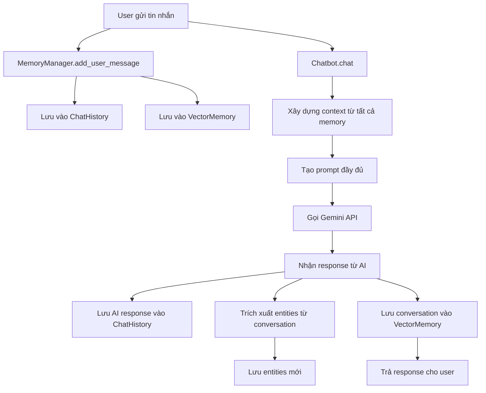

# 🤖 Agent Memory System

Hệ thống chatbot thông minh với bộ nhớ lâu dài sử dụng Google Gemini làm core engine. Chatbot có khả năng ghi nhớ thông tin người dùng qua nhiều phiên trò chuyện khác nhau.

## 🎯 Mục tiêu và Nguyên lý thiết kế

### Vấn đề cần giải quyết
Chatbot truyền thống chỉ nhớ thông tin trong phạm vi một cuộc trò chuyện. Khi người dùng bắt đầu phiên mới, chatbot "quên" hoàn toàn những gì đã học được trước đó. Hệ thống này giải quyết vấn đề bằng cách:

1. **Lưu trữ bền vững**: Dữ liệu được lưu vào file system thay vì RAM
2. **Định danh người dùng**: Mỗi user có ID riêng để phân biệt memory
3. **Bộ nhớ đa tầng**: Kết hợp nhiều loại memory để tối ưu hiệu suất

### Nguyên lý hoạt động cốt lõi
```
Người dùng A chat lần 1 → Lưu vào memory → Thoát
Người dùng A chat lần 2 → Tải memory → Nhớ thông tin cũ
```

## 🧠 Kiến trúc Memory System

### 1. **Entity Memory** - Thông tin cá nhân
**Mục đích**: Lưu trữ các sự thật cụ thể về người dùng
**Cách hoạt động**:
```python
# File: data/entities/user123_entities.json
{
  "tên": ["An", "Nguyễn Văn An"],
  "tuổi": ["25 tuổi"],
  "nghề nghiệp": ["lập trình viên"],
  "sở thích": ["đọc sách", "nghe nhạc", "du lịch"]
}
```

**Luồng xử lý**:
1. User nói: "Tôi tên An, 25 tuổi"
2. Hệ thống phân tích và trích xuất: `tên → An`, `tuổi → 25 tuổi`
3. Lưu vào `JSONEntityStore`
4. Lần sau user hỏi về bản thân → Hệ thống truy xuất thông tin

### 2. **Chat History** - Lịch sử trò chuyện
**Mục đích**: Lưu trữ toàn bộ cuộc trò chuyện để duy trì ngữ cảnh
**Cách hoạt động**:
```python
# File: data/chat_history/user123_default_history.json
[
  {
    "type": "HumanMessage",
    "content": "Xin chào! Tôi tên An.",
    "additional_kwargs": {}
  },
  {
    "type": "AIMessage", 
    "content": "Chào bạn An! Rất vui được gặp bạn.",
    "additional_kwargs": {}
  }
]
```

**Luồng xử lý**:
1. Mỗi tin nhắn được serialize thành JSON
2. Lưu vào file với format `{user_id}_{session_id}_history.json`
3. Khi cần context → Load và convert ngược thành `BaseMessage`

### 3. **Vector Memory** - Tìm kiếm ngữ nghĩa
**Mục đích**: Tìm thông tin liên quan từ các cuộc trò chuyện cũ
**Cách hoạt động**:
```python
# Embedding process
"Tôi thích du lịch Đà Lạt" → [0.1, 0.3, -0.2, ...] (vector 1536 chiều)
"Đà Lạt rất đẹp" → [0.2, 0.4, -0.1, ...] (vector tương tự)

# Khi user hỏi: "Gợi ý địa điểm du lịch"
Query vector → Tìm vectors tương tự → Trả về thông tin về Đà Lạt
```

**Luồng xử lý**:
1. Mỗi đoạn hội thoại được embedding thành vector
2. Lưu vào FAISS vector store với metadata
3. Khi có query mới → Tính similarity → Trả về kết quả liên quan nhất

### 4. **Memory Manager** - Điều phối trung tâm
**Mục đích**: Kết hợp và quản lý tất cả các loại memory
**Cách hoạt động**:
```python
def get_comprehensive_context(self, current_input):
    context = {
        "recent_conversation": self.get_conversation_context(5),
        "relevant_entities": self.get_all_entities(), 
        "relevant_memories": self.search_relevant_memories(current_input),
        "memory_summary": self.get_memory_summary()
    }
    return context
```

## 🔄 Luồng hoạt động chi tiết

### Khi người dùng gửi tin nhắn:



### Chi tiết từng bước:

#### **Bước 1: Tiếp nhận và lưu trữ input**
```python
def chat(self, user_input: str) -> str:
    # Lưu tin nhắn người dùng vào tất cả memory systems
    self.memory_manager.add_user_message(user_input)
```

#### **Bước 2: Xây dựng context**
```python
def _build_context_prompt(self, user_input: str) -> str:
    context = self.memory_manager.get_comprehensive_context(user_input)
    
    # Kết hợp tất cả thông tin:
    # - System prompt
    # - Thông tin entities (tên, tuổi, sở thích...)
    # - Memories liên quan (từ vector search)  
    # - Lịch sử chat gần đây
    # - Câu hỏi hiện tại
```

#### **Bước 3: Gọi Gemini API**
```python
full_prompt = self._build_context_prompt(user_input)
response = self.llm.invoke([HumanMessage(content=full_prompt)])
```

#### **Bước 4: Xử lý và lưu trữ response**
```python
# Lưu response
self.memory_manager.add_ai_message(ai_response)

# Trích xuất thông tin mới
self._extract_and_save_entities(user_input, ai_response)

# Lưu context cho vector memory
self.memory_manager.save_conversation_context(inputs, outputs)
```

## 🏗️ Cấu trúc Code chi tiết

### **config.py** - Cấu hình hệ thống
```python
# API và model settings
GOOGLE_API_KEY = os.getenv("GOOGLE_API_KEY")
MODEL_NAME = "gemini-pro"

# Đường dẫn lưu trữ
ENTITIES_DIR = "./data/entities"      # Entity JSON files
CHAT_HISTORY_DIR = "./data/chat_history"  # Chat history JSON files  
VECTOR_STORE_DIR = "./data/vector_store"   # FAISS vector files
```

### **memory/json_entity_store.py** - Lưu trữ thông tin thực thể
```python
class JSONEntityStore(BaseEntityStore):
    def __init__(self, user_id: str):
        # Mỗi user có file riêng: {user_id}_entities.json
        self.file_path = ENTITIES_DIR / f"{user_id}_entities.json"
    
    def set(self, entity_key: str, entity_value: str):
        # Lưu: entities[entity_key].append(entity_value)
        
    def get(self, entity_key: str):
        # Trả về fact mới nhất của entity
```

### **memory/json_chat_history.py** - Lịch sử trò chuyện
```python
class JSONChatMessageHistory(BaseChatMessageHistory):
    def __init__(self, user_id: str, session_id: str):
        # File format: {user_id}_{session_id}_history.json
        
    def add_message(self, message: BaseMessage):
        # Serialize BaseMessage → JSON → Append to file
        
    def messages(self) -> List[BaseMessage]:
        # Load JSON → Deserialize → Return BaseMessage list
```

### **memory/vector_memory.py** - Vector search
```python
class VectorStoreMemory(BaseMemory):
    def __init__(self, user_id: str):
        # Sử dụng Google Embeddings + FAISS
        self.embeddings = GoogleGenerativeAIEmbeddings()
        self.vector_store = FAISS.load_local() or FAISS.from_documents()
        
    def add_memory(self, content: str, memory_type: str):
        # Embed content → Add to FAISS → Save to disk
        
    def retrieve_memories(self, query: str) -> List[Document]:
        # Embed query → Similarity search → Return relevant docs
```

### **memory/memory_manager.py** - Quản lý tổng thể
```python
class MemoryManager:
    def __init__(self, user_id: str, session_id: str):
        # Khởi tạo tất cả memory components
        self.entity_store = JSONEntityStore(user_id)
        self.chat_history = JSONChatMessageHistory(user_id, session_id)
        self.vector_memory = VectorStoreMemory(user_id)
        
    def get_comprehensive_context(self, current_input: str):
        # Kết hợp thông tin từ tất cả memory sources
        return {
            "recent_conversation": self.chat_history.get_recent_messages(),
            "relevant_entities": self.entity_store.get_all_entities(),
            "relevant_memories": self.vector_memory.get_memory_summary(current_input)
        }
```

### **chatbot.py** - Chatbot chính
```python
class MemoryChatbot:
    def __init__(self, user_id: str, session_id: str):
        # Khởi tạo Gemini LLM
        self.llm = ChatGoogleGenerativeAI(model="gemini-pro")
        # Khởi tạo Memory Manager  
        self.memory_manager = MemoryManager(user_id, session_id)
        
    def chat(self, user_input: str) -> str:
        # Luồng xử lý chính như mô tả ở trên
```

## 💡 Cơ chế Entity Extraction

### Từ khóa nhận diện tự động:
```python
personal_keywords = {
    "tên": ["tên tôi là", "tôi tên", "mình tên", "tôi là"],
    "tuổi": ["tôi", "tuổi", "năm nay", "sinh năm"], 
    "nghề nghiệp": ["tôi làm", "nghề", "công việc", "làm việc tại"],
    "sở thích": ["thích", "yêu thích", "sở thích", "hobby"],
    "địa chỉ": ["tôi ở", "sống ở", "địa chỉ", "quê ở"]
}
```

### Quá trình trích xuất:
1. **Input**: "Xin chào, tôi tên An và làm lập trình viên"
2. **Phân tích**: Tìm thấy từ khóa "tôi tên" → entity type "tên"
3. **Lưu trữ**: `entity_store.add_fact("tên", "Xin chào, tôi tên An và làm lập trình viên")`
4. **Vector**: Cũng lưu vào vector memory để semantic search

## 🔍 Cơ chế Vector Search

### Embedding Process:
```python
# Input text → Google Embedding API → Vector 1536 chiều
"Tôi thích ăn phở" → [0.1, -0.3, 0.7, ..., 0.2]
"Phở là món ăn yêu thích" → [0.2, -0.2, 0.8, ..., 0.1]
```

### Similarity Search:
```python
# Query: "Gợi ý món ăn ngon"
query_vector = embedding.embed_query("Gợi ý món ăn ngon")
similar_docs = vector_store.similarity_search_with_score(query_vector, k=5)
# Trả về: Documents về phở với similarity score cao
```

## 📁 Cấu trúc File System

```
data/
├── entities/
│   ├── user123_entities.json     # Thông tin cá nhân user123
│   └── user456_entities.json     # Thông tin cá nhân user456
├── chat_history/
│   ├── user123_default_history.json    # Lịch sử chat session default
│   ├── user123_work_history.json       # Lịch sử chat session work  
│   └── user456_default_history.json    # Lịch sử user khác
└── vector_store/
    ├── user123_vectorstore/      # FAISS index files cho user123
    │   ├── index.faiss
    │   └── index.pkl
    ├── user123_metadata.json     # Metadata cho vector memories
    └── user456_vectorstore/      # Vector store cho user khác
```

## 🎯 Tính năng chính

### 🧠 Bộ nhớ đa tầng
- **Entity Memory**: Lưu trữ thông tin cá nhân của người dùng (tên, tuổi, sở thích, v.v.)
- **Chat History**: Lưu trữ lịch sử trò chuyện đầy đủ
- **Vector Memory**: Tìm kiếm ngữ nghĩa trong các cuộc trò chuyện cũ
- **Memory Manager**: Quản lý và kết hợp tất cả các loại memory

### 💾 Lưu trữ bền vững
- Tất cả dữ liệu được lưu vào file JSON và FAISS vector store
- Không cần Redis hay SQLite - chỉ cần file system
- Dữ liệu tồn tại qua nhiều phiên chạy ứng dụng

### 🎯 Cá nhân hóa
- Mỗi người dùng có bộ nhớ riêng biệt (dựa trên user_id)
- Chatbot nhớ thông tin cá nhân và sử dụng trong các cuộc trò chuyện
- Tự động trích xuất và lưu trữ thông tin mới

## 🚀 Cài đặt

### 1. Clone repository
```bash
git clone <repository-url>
cd agent_memory
```

### 2. Cài đặt dependencies
```bash
pip install -r requirements.txt
```

### 3. Cấu hình API key
Tạo file `.env` và thêm Google API key:
```bash
GOOGLE_API_KEY=your_google_api_key_here
```

Hoặc set environment variable:
```bash
export GOOGLE_API_KEY="your_google_api_key_here"
```

> 💡 Lấy API key tại: https://makersuite.google.com/app/apikey

## 🎮 Cách sử dụng

### Demo với Streamlit (Giao diện web)
```bash
streamlit run demo_streamlit.py
```

### Demo với CLI
```bash
python demo_cli.py
```

### Ví dụ thực tế về cơ chế hoạt động

#### **Scenario 1: Lần đầu gặp gỡ**
```python
# Phiên 1 - Lần đầu chat
chatbot = MemoryChatbot(user_id="user123", session_id="session1")

# User: "Xin chào! Tôi tên An, 25 tuổi, làm lập trình viên."
response = chatbot.chat("Xin chào! Tôi tên An, 25 tuổi, làm lập trình viên.")
# Bot: "Chào bạn An! Rất vui được gặp bạn. Công việc lập trình viên thế nào?"

# → Hệ thống tự động lưu:
# entities/user123_entities.json: {"tên": ["An"], "tuổi": ["25 tuổi"], "nghề nghiệp": ["lập trình viên"]}
# chat_history/user123_session1_history.json: [HumanMessage, AIMessage]
# vector_store/user123_vectorstore: Embedding của cuộc trò chuyện
```

#### **Scenario 2: Cuộc trò chuyện tiếp theo**
```python
# User: "Tôi thích đọc sách và du lịch"
response = chatbot.chat("Tôi thích đọc sách và du lịch")
# Bot: "Thật tuyệt! Bạn An có thể chia sẻ về những cuốn sách yêu thích không?"

# → Hệ thống cập nhật:
# entities/user123_entities.json: {"sở thích": ["đọc sách", "du lịch"]} được thêm vào
```

#### **Scenario 3: Phiên mới - Bot vẫn nhớ**
```python
# Phiên 2 - Ngày hôm sau
chatbot2 = MemoryChatbot(user_id="user123", session_id="session2")

# User: "Bạn có nhớ tên tôi không?"
response = chatbot2.chat("Bạn có nhớ tên tôi không?")
# Bot: "Dĩ nhiên! Tên bạn là An, bạn là lập trình viên và thích đọc sách cũng như du lịch."

# → Cơ chế hoạt động:
# 1. Load entities từ user123_entities.json → Biết tên là "An"
# 2. Vector search với query "nhớ tên" → Tìm thấy cuộc trò chuyện liên quan
# 3. Kết hợp thông tin → Đưa ra câu trả lời chính xác
```

#### **Scenario 4: Semantic Search trong Memory**
```python
# User: "Gợi ý cho tôi hoạt động cuối tuần"
response = chatbot2.chat("Gợi ý cho tôi hoạt động cuối tuần")
# Bot: "Dựa trên sở thích của bạn, tôi gợi ý: đọc sách mới, khám phá địa điểm du lịch gần nhà..."

# → Cơ chế hoạt động:
# 1. Vector search với "hoạt động cuối tuần" → Tìm thấy thông tin về "sở thích"
# 2. Entity lookup → "sở thích": ["đọc sách", "du lịch"]  
# 3. Kết hợp → Đưa ra gợi ý phù hợp với sở thích cá nhân
```

### Sử dụng trong code
```python
from chatbot import MemoryChatbot

# Khởi tạo chatbot cho user cụ thể
chatbot = MemoryChatbot(user_id="user123", session_id="session1")

# Chat bình thường - bot tự động lưu và nhớ thông tin
response = chatbot.chat("Xin chào! Tôi tên là An.")
print(response)

# Kiểm tra memory đã lưu
memory_info = chatbot.get_memory_summary()
print(f"Đã lưu {memory_info['total_entities']} entities")
print(f"Entities: {memory_info['entities']}")

# Tìm kiếm trong memory
search_result = chatbot.search_memory("tên tôi")
print(f"Kết quả tìm kiếm: {search_result}")
```

## 📁 Cấu trúc dự án

```
agent_memory/
├── memory/                 # Module memory
│   ├── __init__.py
│   ├── json_entity_store.py      # Lưu trữ thông tin thực thể
│   ├── json_chat_history.py      # Lịch sử trò chuyện
│   ├── vector_memory.py          # Vector store memory
│   └── memory_manager.py         # Quản lý tất cả memory
├── data/                   # Thư mục lưu trữ dữ liệu
│   ├── entities/          # File JSON chứa thông tin thực thể
│   ├── chat_history/      # File JSON chứa lịch sử chat
│   └── vector_store/      # FAISS vector store files
├── chatbot.py             # Chatbot chính
├── demo_streamlit.py      # Demo giao diện web
├── demo_cli.py           # Demo command line
├── config.py             # Cấu hình
├── requirements.txt      # Dependencies
└── README.md            # Tài liệu này
```

## 🔧 Cấu hình

Chỉnh sửa file `config.py` để tùy chỉnh:

```python
# Model Gemini
MODEL_NAME = "gemini-pro"
TEMPERATURE = 0.7

# Đường dẫn lưu trữ
DATA_DIR = "./data"
ENTITIES_DIR = "./data/entities"
CHAT_HISTORY_DIR = "./data/chat_history"
VECTOR_STORE_DIR = "./data/vector_store"

# Cấu hình memory
MAX_RETRIEVED_MEMORIES = 5
MAX_ENTITY_FACTS = 50
```

## 🎯 Các tính năng Memory

### 1. Entity Memory
Tự động trích xuất và lưu thông tin cá nhân:
- Tên, tuổi, nghề nghiệp
- Sở thích, địa chỉ
- Thông tin gia đình
- Và nhiều thông tin khác

### 2. Chat History
- Lưu trữ toàn bộ lịch sử trò chuyện
- Tìm kiếm trong lịch sử
- Lấy ngữ cảnh cuộc trò chuyện gần đây

### 3. Vector Memory
- Embedding các cuộc trò chuyện bằng Google Embeddings
- Tìm kiếm ngữ nghĩa trong bộ nhớ
- Truy xuất thông tin liên quan tự động

### 4. Memory Manager
- Kết hợp tất cả các loại memory
- Cung cấp ngữ cảnh toàn diện cho chatbot
- Quản lý lifecycle của memory

## 🎨 Demo Features

### Streamlit App
- Giao diện web thân thiện
- Chat real-time
- Xem thông tin memory
- Tìm kiếm trong bộ nhớ
- Quản lý memory (xóa session/tất cả)

### CLI App
- Giao diện command line
- Menu tương tác
- Đầy đủ tính năng như web app

## 🔬 Ví dụ chi tiết về Memory hoạt động

### **Trường hợp thực tế: User "Minh" sử dụng hệ thống**

#### **Ngày 1 - Cuộc trò chuyện đầu tiên**
```bash
User: Xin chào! Tôi tên Minh, 28 tuổi, làm designer.
Bot: Chào bạn Minh! Rất vui được làm quen. Công việc designer thế nào?

User: Tôi thích thiết kế UI/UX và thường xuyên sử dụng Figma.
Bot: Tuyệt vời! UI/UX là lĩnh vực rất thú vị. Bạn có dự án nào đang làm không?
```

**→ Files được tạo:**
```json
// data/entities/minh_entities.json
{
  "tên": ["Minh"],
  "tuổi": ["28 tuổi"], 
  "nghề nghiệp": ["designer"],
  "sở thích": ["thiết kế UI/UX", "sử dụng Figma"]
}

// data/chat_history/minh_default_history.json
[
  {"type": "HumanMessage", "content": "Xin chào! Tôi tên Minh..."},
  {"type": "AIMessage", "content": "Chào bạn Minh! Rất vui..."},
  // ...
]
```

**→ Vector Store:**
- Embedding các câu về Figma, UI/UX design được lưu vào FAISS
- Metadata gắn với user_id="minh"

#### **Ngày 2 - Phiên chat mới**
```bash
User: Bạn có nhớ tôi không?
Bot: Dĩ nhiên! Bạn là Minh, 28 tuổi, làm designer và thích thiết kế UI/UX với Figma.

User: Tôi đang cần học thêm về animation trong design.
Bot: Dựa trên kinh nghiệm UI/UX của bạn, tôi gợi ý học After Effects hoặc Principle...
```

**→ Cơ chế hoạt động:**
1. **Entity Lookup**: Tìm thấy tên="Minh", nghề nghiệp="designer"
2. **Vector Search**: "animation design" → Tìm thấy thông tin về UI/UX
3. **Context Building**: Kết hợp tất cả thông tin để đưa ra gợi ý phù hợp

#### **Ngày 3 - Truy vấn phức tạp**
```bash
User: Gợi ý cho tôi workflow thiết kế hiệu quả.
Bot: Với kinh nghiệm Figma của bạn Minh, tôi gợi ý workflow: Research → Wireframe → Prototype trong Figma → Animation với Principle...
```

**→ Semantic Search hoạt động:**
- Query "workflow thiết kế" được embed thành vector
- Tìm similarity với vectors về "Figma", "UI/UX design"  
- Kết hợp với entity "nghề nghiệp: designer" → Đưa ra gợi ý cụ thể

### **So sánh với Chatbot truyền thống**

| Chatbot truyền thống | Agent Memory System |
|---------------------|---------------------|
| "Xin lỗi, tôi không nhớ bạn đã nói gì trước đó" | "Bạn là Minh, designer thích dùng Figma" |
| Mỗi phiên là một cuộc trò chuyện mới | Liên tục học và nhớ qua nhiều phiên |
| Không thể cá nhân hóa | Gợi ý dựa trên sở thích và nghề nghiệp |
| Context window hạn chế | Tìm kiếm trong toàn bộ lịch sử |

## 🛠️ Mở rộng và Tùy chỉnh

### **Thêm loại Entity mới**
Chỉnh sửa `personal_keywords` trong `chatbot.py`:

```python
personal_keywords = {
    "tên": ["tên tôi là", "tôi tên", "mình tên", "tôi là"],
    "công ty": ["tôi làm tại", "công ty", "nơi làm việc"],  # Mới
    "học vấn": ["tôi học", "tốt nghiệp", "bằng cấp"],      # Mới
    "mục tiêu": ["mục tiêu của tôi", "tôi muốn", "dự định"], # Mới
    # ...
}
```

### **Tùy chỉnh Vector Search**
```python
# Trong vector_memory.py
def retrieve_memories(self, query: str, k: int = 5, filter_by_type: str = None):
    # Thêm filter theo loại memory
    if filter_by_type:
        docs = self.vector_store.similarity_search(
            query, k=k, 
            filter={"type": filter_by_type}
        )
    else:
        docs = self.vector_store.similarity_search(query, k=k)
    return docs
```

### **Tích hợp Database thực tế**
```python
# Ví dụ: PostgreSQL Entity Store
class PostgreSQLEntityStore(BaseEntityStore):
    def __init__(self, user_id: str, connection_string: str):
        self.user_id = user_id
        self.conn = psycopg2.connect(connection_string)
    
    def set(self, entity_key: str, entity_value: str):
        cursor = self.conn.cursor()
        cursor.execute(
            "INSERT INTO entities (user_id, entity_key, entity_value) VALUES (%s, %s, %s)",
            (self.user_id, entity_key, entity_value)
        )
        self.conn.commit()
```

### **Thay đổi LLM**
```python
# Sử dụng OpenAI thay vì Gemini
from langchain_openai import ChatOpenAI

class MemoryChatbot:
    def __init__(self, user_id: str, session_id: str = "default"):
        self.llm = ChatOpenAI(
            model="gpt-4",
            openai_api_key=OPENAI_API_KEY,
            temperature=TEMPERATURE
        )
        # ... rest của code giữ nguyên
```

### **Thêm Memory Type mới**
```python
# Ví dụ: Preference Memory cho sở thích chi tiết
class PreferenceMemory:
    def __init__(self, user_id: str):
        self.user_id = user_id
        self.preferences = {}
    
    def add_preference(self, category: str, item: str, score: float):
        # Lưu sở thích với điểm số
        if category not in self.preferences:
            self.preferences[category] = {}
        self.preferences[category][item] = score
    
    def get_top_preferences(self, category: str, limit: int = 5):
        # Trả về top sở thích theo điểm số
        return sorted(
            self.preferences.get(category, {}).items(),
            key=lambda x: x[1], reverse=True
        )[:limit]
```

## 📝 Lưu ý

1. **API Key**: Cần Google API key để sử dụng Gemini
2. **Dung lượng**: Vector store có thể tăng kích thước theo thời gian
3. **Performance**: Với nhiều dữ liệu, có thể cần tối ưu hóa tìm kiếm
4. **Bảo mật**: Không lưu thông tin nhạy cảm trong memory

## 🤝 Đóng góp

Mọi đóng góp đều được chào đón! Hãy tạo issue hoặc pull request.

## 📄 License

MIT License - xem file LICENSE để biết chi tiết.